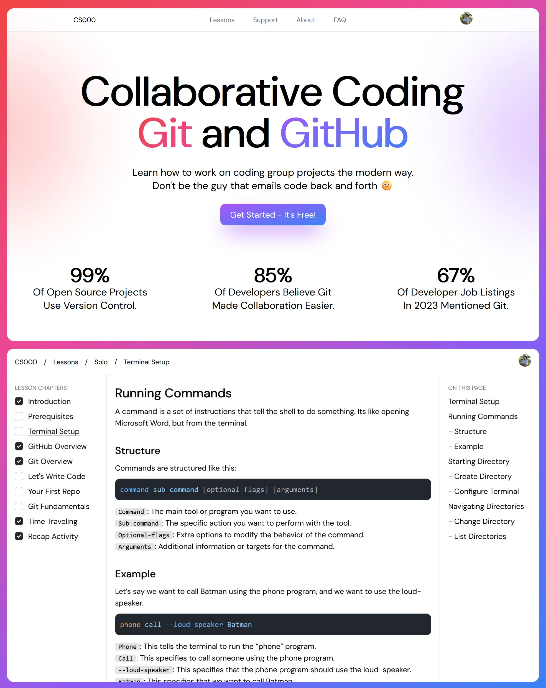

 

    

 

<picture>
  <source media="(prefers-color-scheme: dark)" srcset="./docs/banner-dark.webp">
  <source media="(prefers-color-scheme: light)" srcset="./docs/banner-light.webp">
  
</picture>

 

  <h3>
    Learn how to work on coding group projects the modern way.
     
    Don't be the guy that emails code back and forth.
  </h3>
  <a href="https://cs000.dev/">Get Started</a> •
   <a href="https://cs000.dev/contribute">Contribute</a> •
   <a href="https://discord.gg/cJxBsq8Qmh">Discord</a> •
  <a href="https://cs000.dev/about#faq">FAQ</a>

 
 

## 💭 What Is CS000?

CS000: collaborative coding with Git and GitHub is an open source project that aims to provide a simple and beginner-friendly introduction to version control. It is an interactive web based course with 0 prerequisites and can be completed in 3 days. All for a grand total of $0.00.

## 🚀 Features

-   User Auth - students can create a CS000 account using either Google or GitHub.
-   Progress Tracking - students can keep track of which lessons they have completed.
-   Interactive Lessons - students can answer questions and interact with components.

## ✨ Built With

-   [Astro.js](https://astro.build) - Primary frontend and backend framework.
-   [React.js](https://react.dev) - Advanced and interactive UI components.
-   [TailwindCSS](https://tailwindcss.com) - Simple and powerful CSS framework.
-   [Nanostores](https://github.com/nanostores/nanostores) - Lightweight state management.
-   [MDX](https://mdxjs.com) - Interactive components for Markdown content.
-   [Auth.js](https://authjs.dev) - Google and GitHub OAuth providers.
-   [Prisma](https://prisma.io) - Schema design and database interaction.
-   [Neon](https://neon.tech) - Managed serverless Postgres database.
-   [Umami](https://umami.is/) - Analytics and Event Tracking.

## 💖 Contribute

Developers of all skill levels are welcome to contribute to this project. If you are student who is new to web development, feel free to [report bugs](https://github.com/anav5704/CS000/issues/new?template=bug_report.md&title=[BUG]) or [request feature](https://github.com/anav5704/CS000/issues/new?template=feature_request.md&title=[FEATURE]). If you have experience in the web development field, you can [contribute code](https://github.com/anav5704/CS000/blob/main/.github/CONTRIBUTING.md) to the project. Before you start, make sure there are no existing [issues](https://github.com/anav5704/CS000/issues) or [pull requests](https://github.com/anav5704/CS000/pulls) that are related to your contribution.
