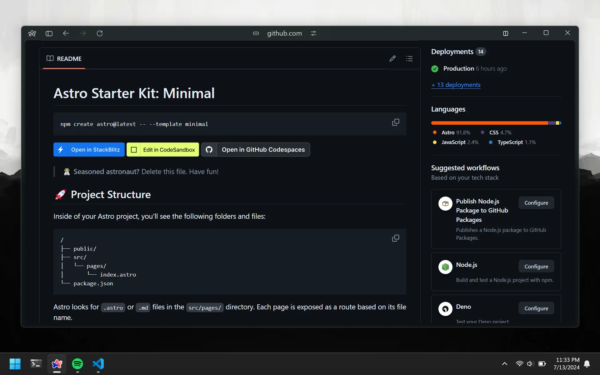

# Documentation

Adding documentation to your repos may seem like a chore. They're boring and have no real value. **Wrong**. It is one of the most underrated pieces of text, especially when you are a beginner. Firstly, it shows that you are taking programming seriously and have the initiative to write docs. Secondly, it is the only way a new person can know what's inside your repo. Whether your repo has 10 or 10k lines of code, no one will open those folders. Having docs is a sneak peek into what's inside your repo.

# Writing Markdown

Yes you're going to learn to write a new language now. So markdown is like plain text with some special characters here and there. It allows you to write simple text that gets rendered as HTML. If you don't know HTML, that's fine. In fact, markdown was actually invented for non-technical people to write content for the web. Let's go over the basics you will need to write your docs.

## Headings

Headings are the title of your document. They are written in the format `# Heading`. The number of `#` determines the size of the heading. Heading 1 is the largest heading, heading 6 is the smallest.

```markdown
# Heading 1

## Heading 2

### Heading 3
```

## Paragraphs

Paragraphs are the text that you write. No special formatting is needed.

```markdown
Paragraphs are the text that you write.
```

## Lists

Lists are the way to add items to your document. You can make bulleted lists or numbered lists.

```markdown
-   Item 1
-   Item 2
-   Item 3

1.  Item 1
2.  Item 2
3.  Item 3
```

## Links

Links are the way to link to other pages on your site. You can link to a page on the same site or to an external site.

```markdown
[Internal Link](#next-subtitle)
[External Link](https://www.google.com)
```

## Images

Images are the way to add images to your document. You can add images to your document by using the `!` syntax.

```markdown


```

## Code

Markdown is great for writing text. But what if you want to write code? Well, you can do that too. You can use the ` ``` ` syntax to add code blocks with the language specified.

````markdown
```cpp
int function add(int a, int b) {
    return a + b
}
```
````

## Example

Funny enough, all the lessons on CS000 are written using Markdown. Here is what this page looks like (did we break the 4th wall?):

````markdown
# Documentation

Adding documentation to your...

# Writing Markdown

Yes you're going to learn to...

## Headings

Headings are the title of your...

```markdown
# Heading 1

## Heading 2

### Heading 3
```

## Paragraphs

Paragraphs are the text that...

```markdown
Paragraphs are the text that...
```

## Links

Links are the way to link to other...

```markdown
[Internal Link](#next-subtitle)
[External Link](https://www.google.com)
```
````

Markdown has many more powerful features, if you are interested in learning more, check out the [official documentation](https://www.markdownguide.org/basic-syntax/).

# Adding Docs

Now that you know how to write Markdown, you can start adding docs to your repos. You will need to create a `README.md` file in the root of your repo. You can have a `docs` directory as well to store images you want to reference in your README.

```bash
code
└── CS000
    ├── docs
    │   └── image.webp
    ├── README.md
    ├── sum.cpp
    └── sum.exe
```

The `README.md` file is the file that will be displayed on the GitHub page of your repo. Add your docs and then push the changes to GitHub. You can find the docs under the list of files in your GitHub repo. Here is what it would look like once you push your changes:


