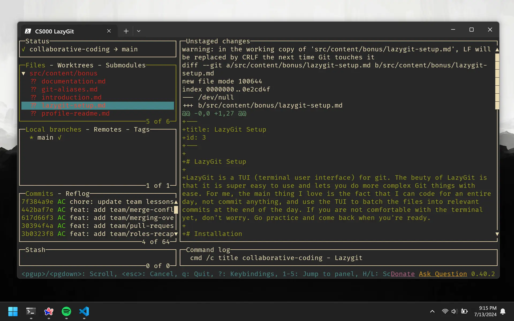

# LazyGit Setup

LazyGit is a TUI (terminal user interface) for git. The beuty of LazyGit is that it is super easy to use and lets you do more complex Git things with ease. For me, the main thing I love is the fact that I can code for an entire day, not commit anything, and use the TUI to batch the files into relevant commits at the end of the day. If you are not comfortable with the terminal yet, don't worry. Go practice and come back when you're ready.

# Installation

LazyGit will be installed using the terminal. Open up your terminal and run the command specific to your operating system.

## Windows

Make sure you have [Scoop](https://scoop.sh/) installed.

```bash
scoop bucket add extras
scoop install lazygit
```

## MacOS

```bash
brew install lazygit
```

# Run LazyGit

You will have to navigate to the directory you want to use LazyGit in using the teminal. Then run the command `lazygit` to open up the TUI.

```bash
lazygit
```

If you are not in a Git repo, you will be given an option to initialize Git. Thsi may look overwhelming at first but it is very simple once you've made a few commits.



There is a decent bit of things to learn and not many people will want to use it. This is why I will not provide instructions on how to use it. Rather, I will provide some resources that will help you get started.

## Resources

-   [LazyGit Docs](https://github.com/jesseduffield/lazygit)
-   [LazyGit Video](https://www.youtube.com/watch?v=PBOLSJCu024)

# LazyGit Global Alias

Just as we set a global alias for `git`, we can set a global alias for `lazygit`. Do this yourself. If you are stuck then you can refer to the chapter wehre we get a global alias for `git`. Since our alias for `git` was `g`, we can use `l` for `lazygit`.
