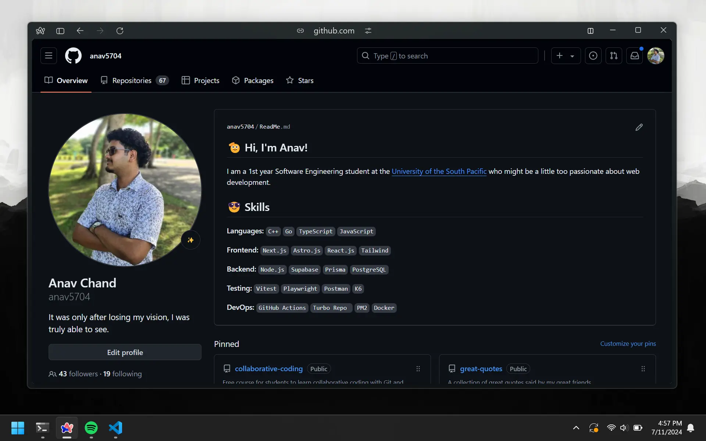
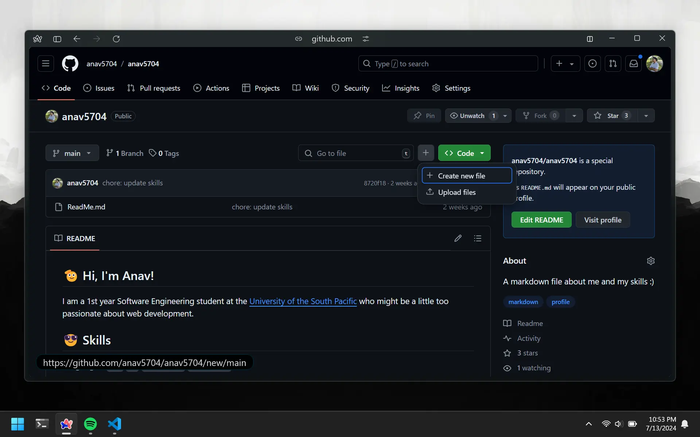

# Profile README

When visitors land on your profile page, they'll see a basic overview of your profile information. This includes things like your name, bio, and links to your social media accounts. You can also create what's called a `README` for your profile. This is a Markdown file that will be rendered on your profile page. Here's mine (the stuff on the right):

Having a `README` is not required, but it is a good idea to have one. It will be the first thing people see when they visit your profile page. Having a nice looking `README` will make your profile more appealing to visitors. In addition, it is a great way to showcase your skills and experience.

# Create Repo

We will need to create a GitHub repository for your profile. The name of this repo will have to be **exactly the same as your username**. You should have enough experience with GitHub to know how to do this on your own.

# Generating README

For the sake of keeping everything simple, we are going to use an online generator to create our `README`. We will discuss how to use Markdown to write proper README's in the next chapter. Here are some of the options you can use:

-   [GRPM](https://gprm.itsvg.in/)
-   [README Generator](https://rahuldkjain.github.io/gh-profile-readme-generator/)

Most of the online generators have the same process. You add some text for things like your bio, interests, and social media links. Then you get to chose from a list of icons for the languages and tools you know. Alternatively, you can just make your own like I did.

# Pushing To GitHub

Once you have generated your `README`, you can push it to your GitHub repository. GitHub will pick this up display it on your profile page. If you don't want to clone the and then push the code, you can just add the `README` from GitHub itself, either by adding or uploading it. This can be done by clicking on the `Add File` button beside the green `code` button.

# Pinned Repositories

Underneath the `README` you can find a pinned repositories section. Once you have some repos to pin, add some of your favorite ones here.
