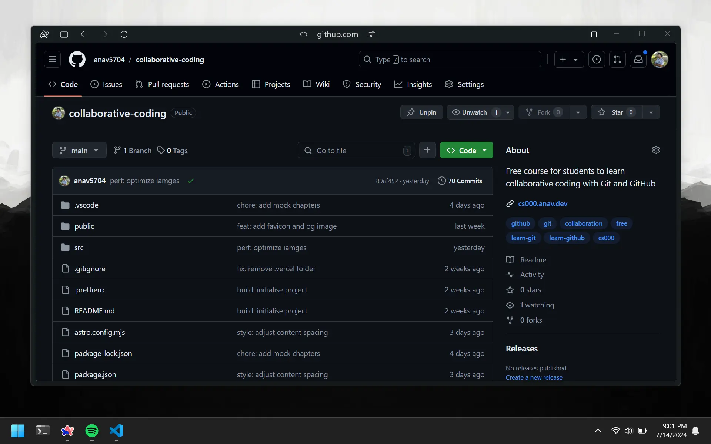

# SEO For Repos

SEO, short for Search Engine Optimization, is the process of improving the performance, experience, and authority of your website. It is important to have a good SEO strategy to get your website to show up in search results. Now you may not know web development, and you may not have a website to add SEO to. But that doesn't matter. There is a free website with great SEO already made for you: GitHub.

# Meta Tags

In web development, meta tags are HTML elements that hold information about the website which browsers use. This information is also used by Google to rank websites on search results. The `title` of your repo maps to GitHub's title tag for your repo and same with the `description`. This is why you must carefully name your repo and always add a description that has keywords.

Here you can see I have searched for `Batman Discord Bot`. I have scrolled a bit, so the 3rd result is my repo from GitHub and the 4th is from my [personal website](https://www.anav.dev). I had to work hard to get my own website to show up in the search results. But to get GitHub to show up is as easy as filling the `Title` and `Description` fields.

# Topics

GitHub Topics are a way to categorize your repo. They allow users to explore repositories in a particular subject area, find projects to contribute to, and discover new solutions to a specific problem. You can add topics to your repo to make it easier for others to find it. You can add topics to your repo by clicking on the `Edit` button on the right side of the repo page.

