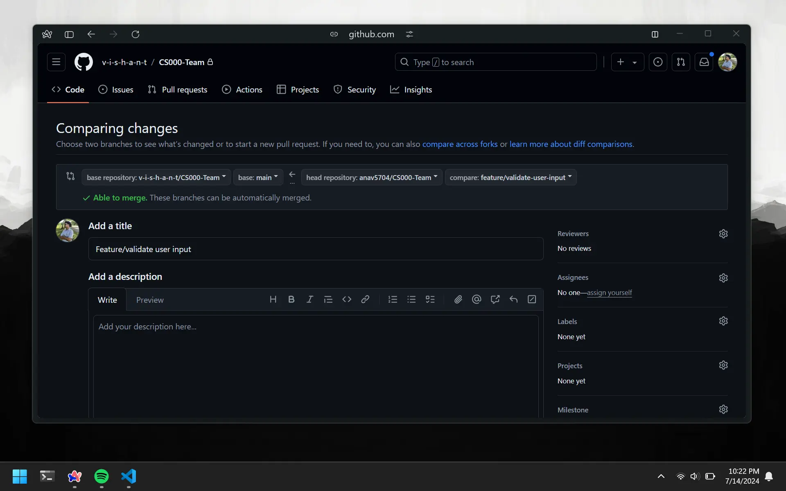

# Workflow Example

In this lesson, we are going to go through the whole process of using GitHub flow to contribute to a assignment repo. We will use the same scenario as in the team lesson. Let's assume that the group leader has already created and pushed the main assignment repo to GitHub.

# Fork and Clone

The process of forking and cloning a repo should be second nature to you. Go on fork and clone the repo to your local machine. If you click on the branch dropdown, you will only see the main branch.


# Create Branch

Suppose we are to add a new feature to the assignment. This time we are required to validate the user input. So we will create a new branch called `feature/validate-user-input` and add the feature code to it.

```bash
git checkout -b feature/validate-user-input
```

# Add Feature

Now we are ready to add the feature code to the branch.

```cpp
#include <iostream>
using namespace std;

int main() {
    int choice;

    cout << "CS000 Assignment!" << endl;

    cout << "What would you like to do?" << endl;

    cout << "1. Star the Repo" << endl;
    cout << "2. Contribute to the Repo" << endl;

    cin >> choice;

    // validate user input
    while(cin.fail()) {
        cin.clear();
        cout << "Invalid input, please try again: " << endl;
        cin >> choice;
    }

    return 0;
}
```

# Push Changes

Remember, when working on a branch, Git doesn't know where to push the changes. This is why we set up upstream branch tracking. This will only be done once.

```bash
git push -u origin feature/validate-user-input
```

If you go back to GitHub, you will see that now there is a new `feature branch` under the main branch.


# Create Pull Request

You can quickly create a pull request by clicking on the `Compare & pull request` button. Alternatively, you can create a pull request by going to the `pull requests` tab and clicking on the green `New pull request` button. You will manually have to select the base branch and compare branch.



# Merge Pull Request

The repo `owner` will review the pull request and merge it into the main branch. You will see that the feature branch has been merged into the main branch.

# Delete Branch

You can delete the feature branch once it has been merged into the main branch.

```bash
git branch -d feature/validate-user-input
```

# Update Main

Your other group members will also be making changes and having their own feature branches merged into the main branch. To update main, you first need to switch to the main branch if you are not already there.

```bash
git checkout main
```

Then you can pull the changes from the main branch.

```bash
git pull
```

You can now create a new branch and start working on the new feature. If you did not delete your previous feature branch and want to continue working on it with the new changes from the main branch, you can do the following.

```bash
git checkout feature/validate-user-input
git merge main
```

This will switch to the feature branch and merge the latest changes from the main branch.
