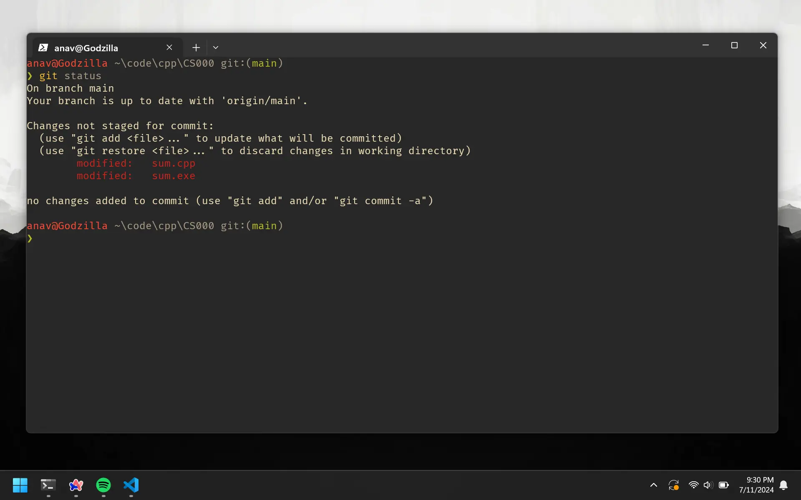
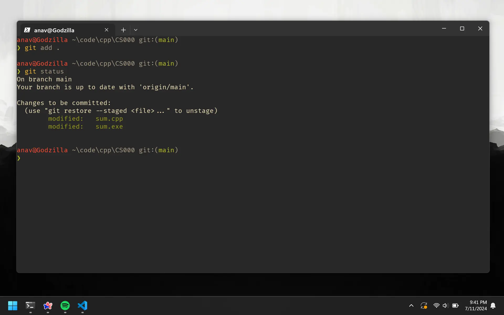
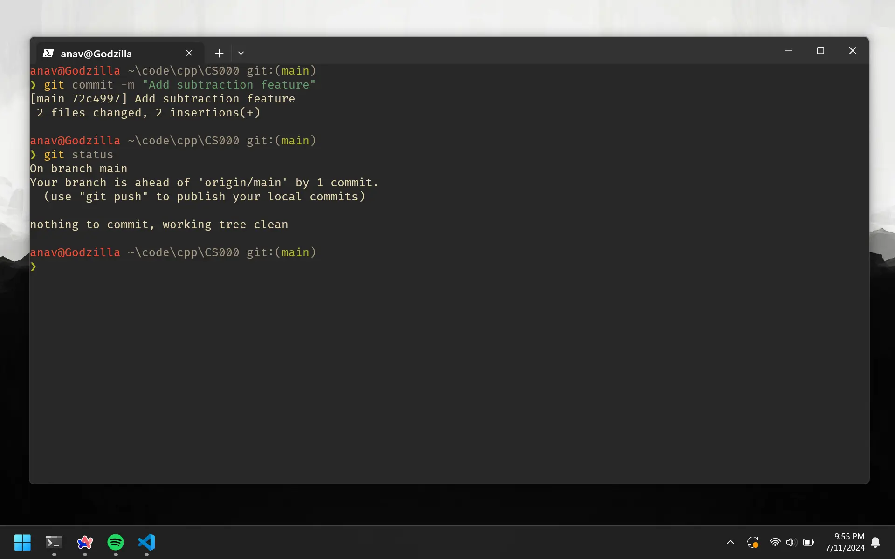
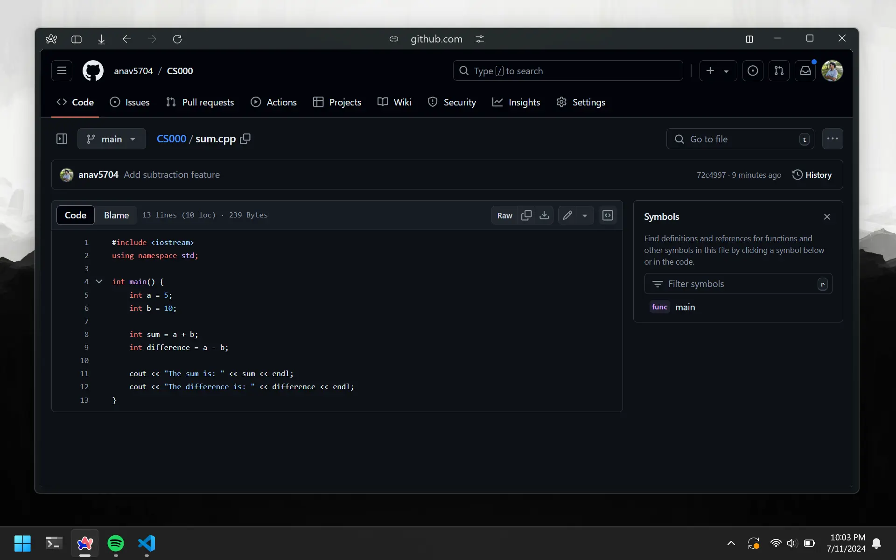

# Git Fundamentals

Copy-pasting that chunk of code from the previous lesson might have felt a bit off. There was a lot of git commands on it and none were explained. This chapter will go over those commands and explain what they do. In order to do so, let's go back and edit our code.

# Modify Code

Assume we are required to subtract the numbers too.

```cpp
#include <iostream>
using namespace std;

int main() {
    int a = 5;
    int b = 10;

    int sum = a + b;
    int difference = a - b;

    cout << "The sum is: " << sum << endl;
    cout << "The difference is: " << difference << endl;
}
```

Compile and run to see if everything works. Now, use the terminal and navigate to the `code/CS000` on your own.

# Git Status

This shows the status of changes in your project as untracked, modified, or staged.

```bash
git status
```

The output in our case shows that the `sum.cpp` and `sum.exe` files have been modified. The red color on the file names indicates that the changes have not been staged.



# Git Add

This command adds changes in the specified file to the staging area. Instead of specifying files to add, we can use a `dot` to add all the changes in the current directory.

```bash
git add .
```

Now, let's check the status again.

```bash
git status
```

This time, the `sum.cpp` and `sum.exe` files are staged. The red color on the file names has been removed.



At this point, we have made changes to our code and added them to the staging area. But what is the staging area? It is a place where we can store changes before committing them to the repository. Similar to how passengers wait in a train station for the train to arrive.

# Git Commit

This command commits the staged changes with a descriptive message. A message flag is required (the `-m "commit message"`).

```bash
git commit -m "Add subtraction feature"
```

Now, let's check the status again.

```bash
git status
```

The `sum.cpp` and `sum.exe` files have been committed, that's why they are not being shown as before.



So right now, we have saved our changes to the local repository. We essentially created a checkpoint for our code. If we continue to work and make a mistake, we can always go back to this commit and continue from there.

# Git Push

This command pushes the committed changes to the remote repository (GitHub).

```bash
git push
```

If we go back to GitHub, and click on he `sum.cpp` file. You can see that our changes have been pushed. I just realized that naming the program `sum.cpp` and calculating the difference too inside is stupid.



# Ignore Files

Sometimes, we don't want to commit changes to a file. In this case, we are always pushing our `sum.exe` file to the remote repository. It has no values as the code can be compiled using the `sum.cpp` file. So, we can ignore the `sum.exe` file but putting it in a `.gitignore` file.

Create a `.gitignore` file in the `code/CS000` directory and add the following line. Also d

```
*.exe
```

This basically tells git to ignore all files with the `.exe` extension. While were here, lets delete all existing `.exe` files and rename the `sum.cpp` file to `math.cpp`.

Now, let's commit and push the changes.

```bash
git add .
git commit -m "Ignore .exe files and rename sum.cpp to math.cpp"
git push
```

# Recap

This is what you need to do when you first make the repo:

```bash
git init
git add .
git commit -m "first commit"
git branch -M main
git remote add origin https://github.com/anav5704/CS000.git
git push -u origin main
```

And this is what you do every consecutive time you make a change:

```bash
git add .
git commit -m "commit message"
git push
```
