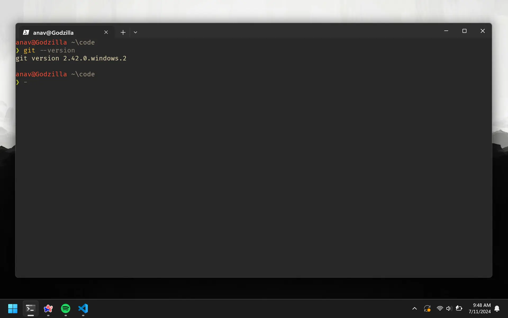

# Git Overview

Git is a command line tool that lets you manage your code. Git is a software that lives on your computer. As a solo developer, the main feature of Git that you will use mostly is its ability to version your code. You know how there are checkpoints in games? So when you die you respawn there. That's what Git does. You can create your own checkpoints and you can go back to them.

# Downloading Git

If you are on macOS, Git is already installed on your computer. If you are on Windows, you can download it from [here](https://git-scm.com/download/win).

# Running Git

Git will be used like any other command line tool. Remember how we called Batman using the phone program earlier? It looked like this:

```bash
phone call --loud-speaker Batman
```

This time we want to run `Git` instead of `Phone`. So the command will be Git. We do not need any sub-commands or arguments here:

```bash
git --version
```

This will tell you the version of Git that you have installed on your computer.



Git has a ton of commands. We will go over the important ones after setting up GitHub and writing some code.

# Connecting GitHub

You will need to do this only once per computer.

```bash
git config --global user.name "Your Name"
git config --global user.email "your@email.com"
```

You will be asked to authenticate your GitHub account, so just sign in with the same email to confirm.
