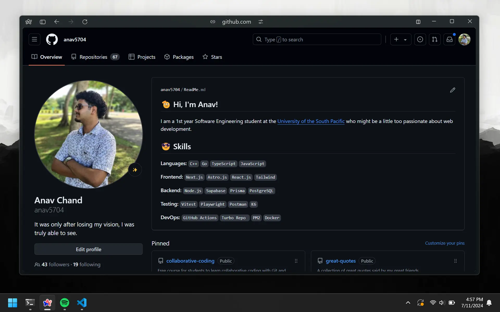
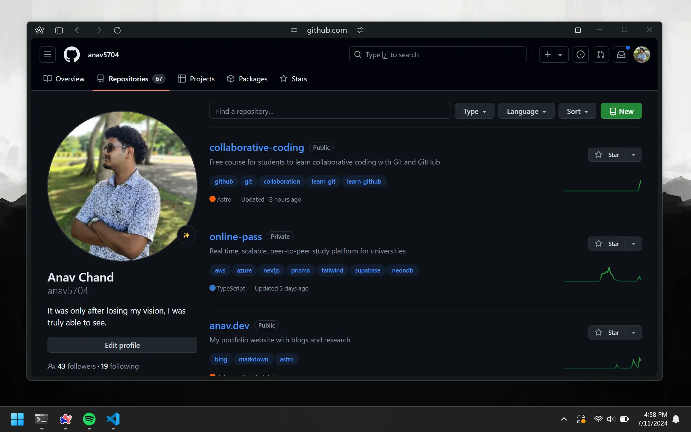
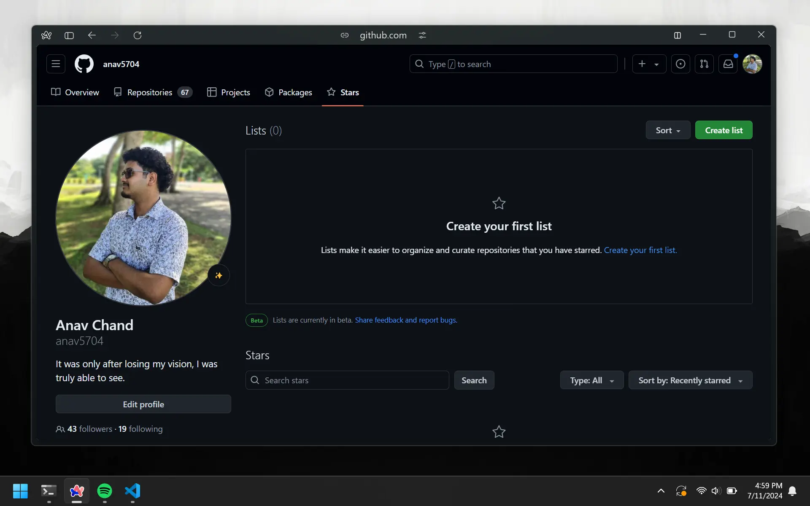

# GitHub Overview

GitHub is a website that lets you store your code online. It is quite literally Google Drive for code if Microsoft built it. This also happens to be the main feature you as a solo developer will use most. You will be able to access your code from anywhere and on any device.

In addition to this, GitHub can be used as a portfolio for your projects. GitHub is well known and has magnificent SEO so if you document your projects properly, you can get a lot of exposure. This will be covered in the bonus lessons.

# Create Account

Head over to [GitHub](https://github.com) and create an account. You should also set up 2FA using the GitHub mobile app if the sign-up process prompts you to do so. Note that the username you chose will in various places as it will be a part of the GitHub URL of every repo you create. So this means changing your username will break all of your links.

# GitHub Tour

GitHub is a pretty big website, and you may feel lost when you start off. Here are the 3 main tabs you need to know about:

## Overview Tab

This is more of a quick public facing profile. You can create a bio kind of thing here. Underneath that you can pin repositories, that you might want to show off.

## Repositories Tab

Repositories are just folders that store your code. You can create a new repository by clicking the green button on the top right. The green line chart on the right of each repo shows the number of commits made over time.

## Stars Tab

Stars are GitHub's way of bookmarking repos. Stars are more than just that though. They are taken pretty seriously. The more stars a repo has, the more likely it is to be discovered by other developers. They are also a way of validating the authenticity of a repo. Speaking of which, you should star [CS000](https://github.com/anav5704/collaborative-coding) 😉

