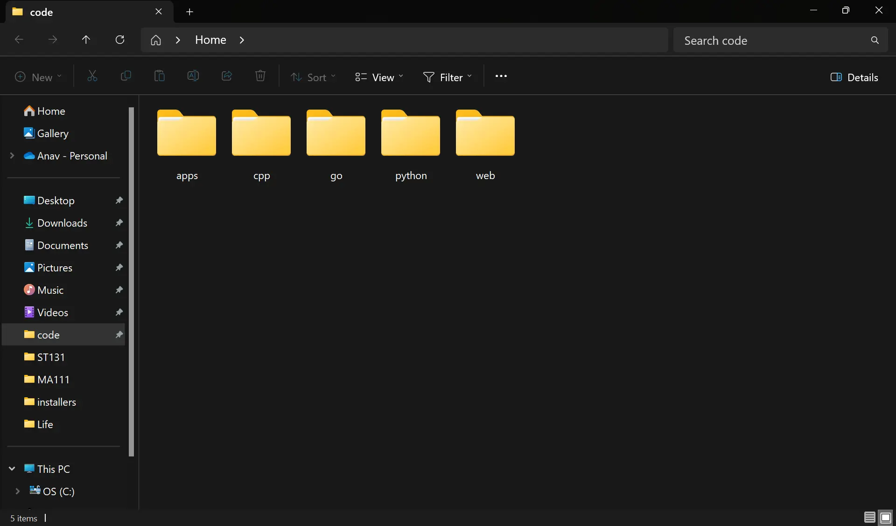
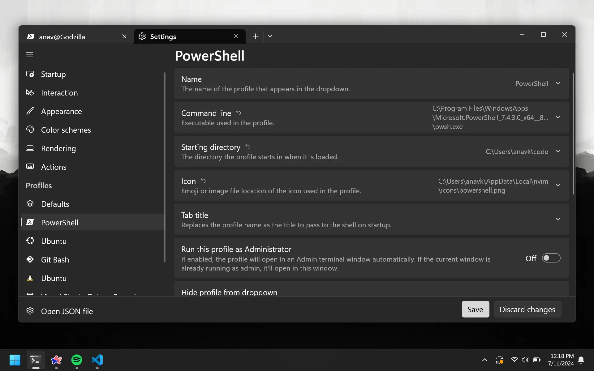
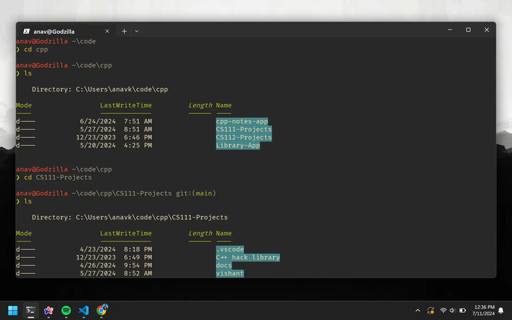

# Terminal Setup

To run Git, we're going to use the terminal. I know that the terminal might sound scary, and it is. But you can't learn without making mistakes. macOS users can use the default terminal app with [Zsh](https://en.wikipedia.org/wiki/Z_shell). For Windows users, I recommend using [PowerShell](https://docs.microsoft.com/en-us/powershell/scripting/overview?view=powershell-7.2) as your terminal shell.

For clarity, the terminal, aka `The Black Screen` is the application you open on your computer. It provides a window where you can type commands. The shell is the program running inside the terminal. It interprets the commands you type and executes them.

# Running Commands

A command is a set of instructions that tell the shell to do something. Its like opening Microsoft Word, but from the terminal.

## Structure

Commands are structured like this:

```bash
command sub-command [optional-flags] [arguments]
```

`Command`: The main tool or program you want to use.\
`Sub-command`: The specific action you want to perform with the tool.\
`Optional-flags`: Extra options to modify the behavior of the command.\
`Arguments`: Additional information or targets for the command.

## Example

Let's say we want to call Batman using the phone program, and we want to use the loud-speaker.

```bash
phone call --loud-speaker Batman
```

`Phone`: This tells the terminal to run the "phone" program.\
`Call`: This specifies to call someone using the phone program.\
`--loud-speaker`: This specifies that the phone program should use the loud-speaker.\
`Batman`: This specifies that we want to call Batman.

# Starting Directory

The starting directory is the directory that the terminal loads up when you open it. It's a good idea to make the starting directory the directory where you keep your coding projects.

## Create Directory

To keep things organized, let's make a `code` directory. You can place this directory anywhere on your computer. Mine is locateda at `C:/Users/anav/code`. This is what it loks like:



## Configure Terminal

Now that we have our directory, let's configure the terminal to open in this directory.

-   **Windows** - `Settings > Profiles > Starting Directory`.
-   **macOS** `Preferences > General > Working Directory`.



Every time you open the terminal, it will already be in the directory we chose.

# Navigating Directories

Navigating directories is a very important skill. It's the same as look for files and folders using the file explorer. Let's say we want to go to the `cpp` directory that is inside the `code` directory.

## Change Directory

Assuming that the `code` directory is in the starting directory, we can use the `cd` command to change directories. This will change the directory to the `cpp` directory.

```bash
cd cpp
```

Now let's go into a project in the `cpp` directory. Oh but what if we don't know the name of the directory?

## List Directories

We can use the `ls` command to list the contents of the current directory.

```bash
ls
```

Once we know the name of the directory, we can use the `cd` command to change directories again.

```bash
cd CS111-Projects
```

All of this combined should look something like this:


