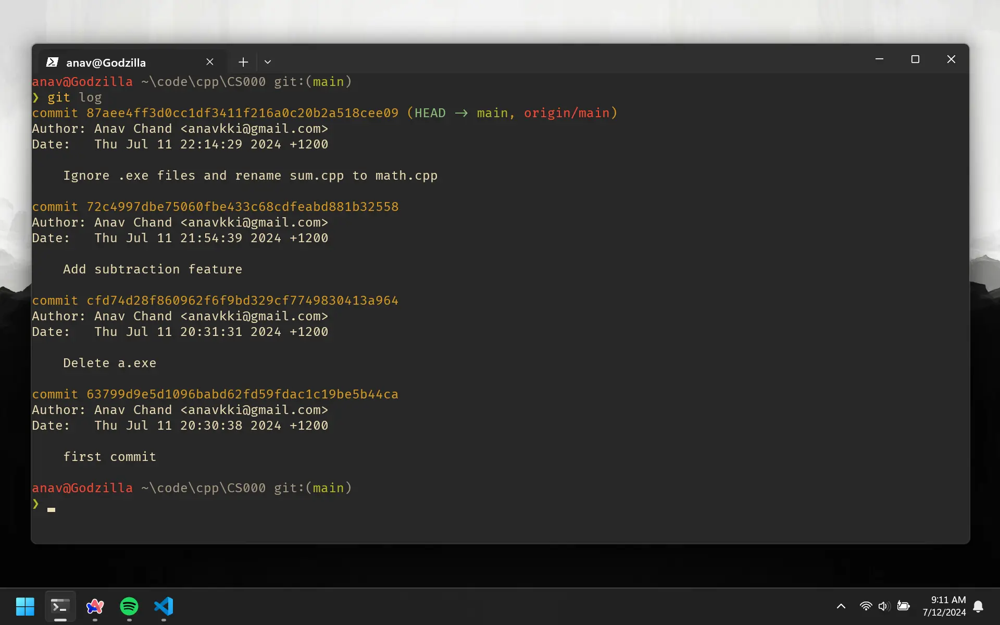
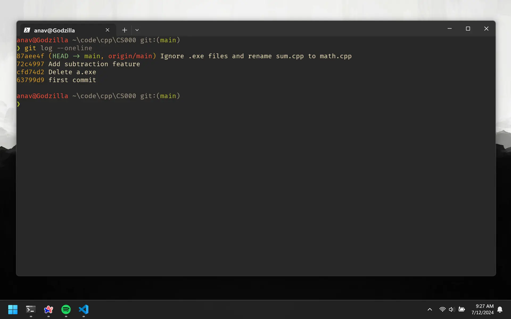
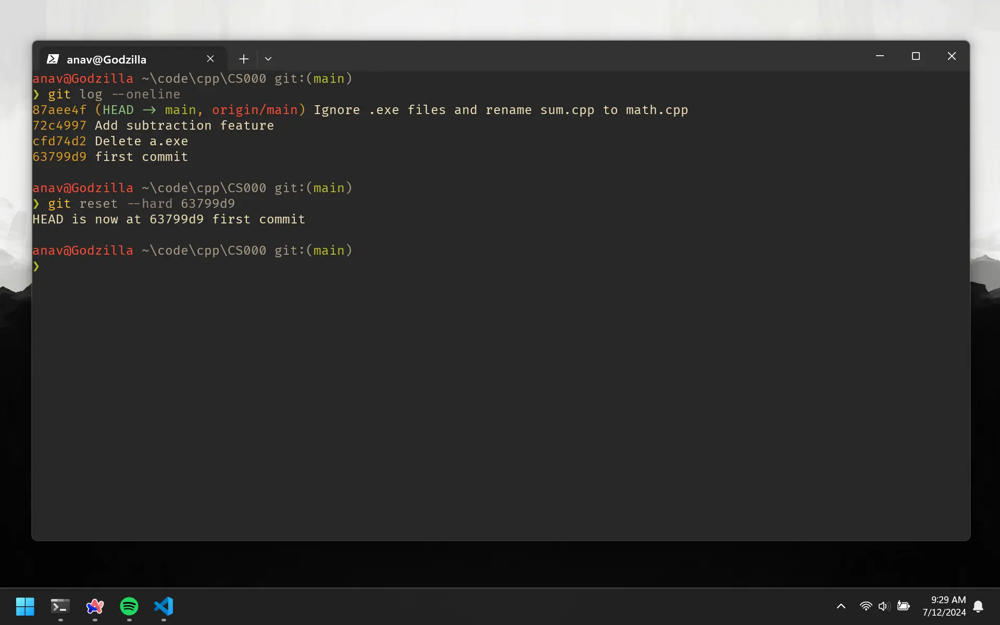
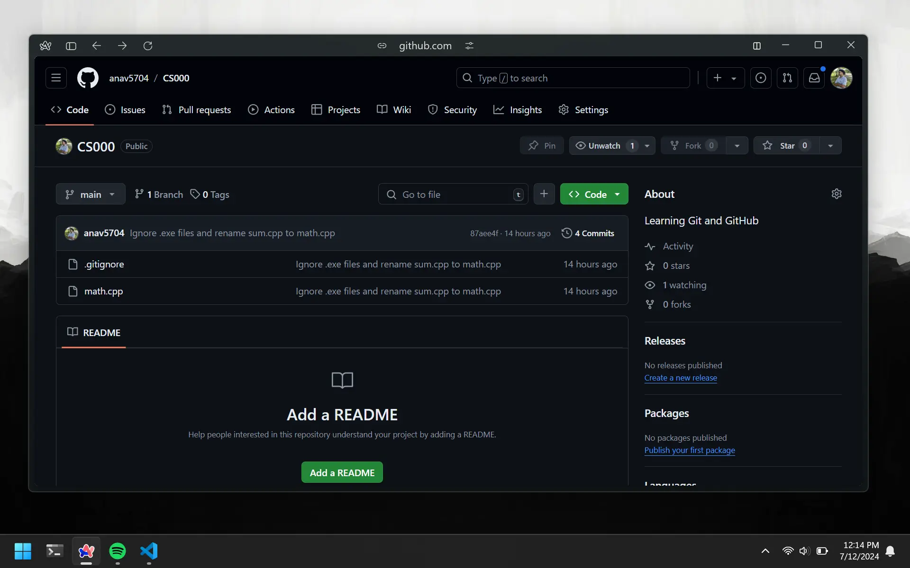
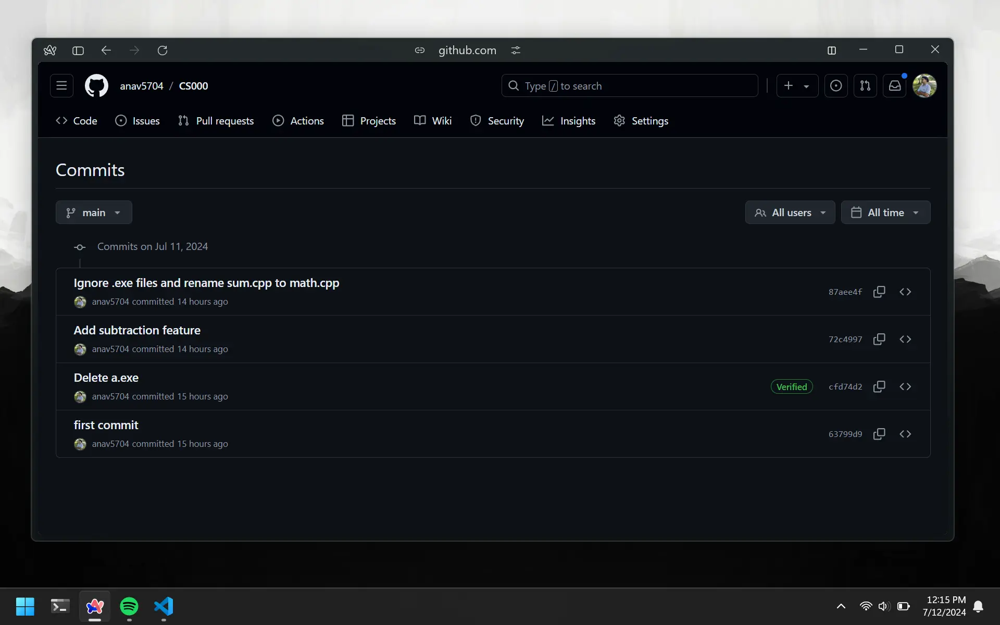

# Time Traveling

Sometimes, you might end up in a situation where you want to go back to one of your previous commits. We can travel back in time and restore our codebase to be as it was at that time. Just one small catch, you can only go back in time and the changes cannot be undone. Before we do that, let's check what our commit history looks like.

# Git Log

This command shows a list of all the commits in the repository's history.

```bash
git log
```

The output shows each commit in chronological order, along with the commit hash (the long string of numbers) and the commit message.



# Git Head

Notice how `HEAD` is pointing to the most recent commit. This is the commit that our code is currently on. If we were to create another commit, the `HEAD` would point to that new commit.

```bash
 commit 87aee... (HEAD -> main, origin/main)
```

The `main` is referring to the local branch and `origin/main` is referring to the branch on GitHub.

# Git Reset

Say in our case, we want to go back to the commit when we created the repo and added the sum feature (the first commit). All we need is the commit hash for the first commit. Using the whole hash is not ideal, so let's use the shorter version.

```bash
git log --oneline
```

This shows us a compact version of the commit hash and the commit message.



Let's grab the hash for the first commit and use it to reset the `HEAD` to that commit.

```bash
git reset --hard 63799d9
```

This command resets the `HEAD` to the commit with the hash `63799d9`. If you run `git log` again, you will see that the `HEAD` is now pointing to the first commit.



# Quick Reset

In our case, we had 3 commits with no changes to our code. Let's say you were trying to add a `divide` feature to the code and decided you wanted to undo it. If you did not commit those changes, you can simply do this:

```bash
git reset --hard HEAD
```

This command will discard all the uncommitted changes and reset the `HEAD` to the most recent commit.

# Commit History

Every time you push your code to GitHub, it saves a snapshot of your code. GitHub will basically keep different versions of your code. This means you can view older versions of your code and see how it looked at a certain point in time. This is especially helpful when you delete things. You can go view a previous version of your code and see what it looked like before you deleted it.

In order to do so, first go to your repository on GitHub and click on the button `Commits` button under the green `Code` tab. This will show you all the commits in chronological order.



Once you are on the commits page, just pick the commit you want to go back to and click on the `Browse files` button. This is located beside the `Copy` button, which is beside the `Commit hash`.


