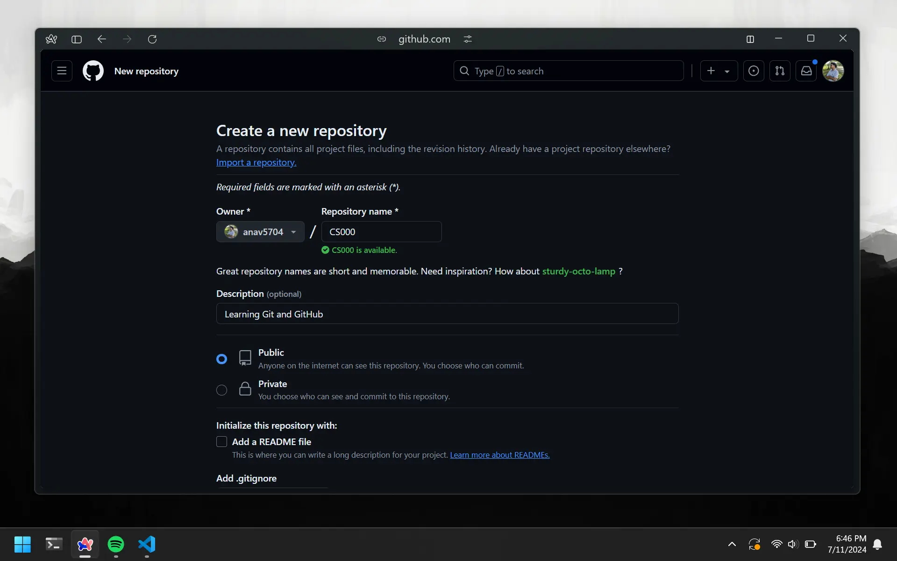
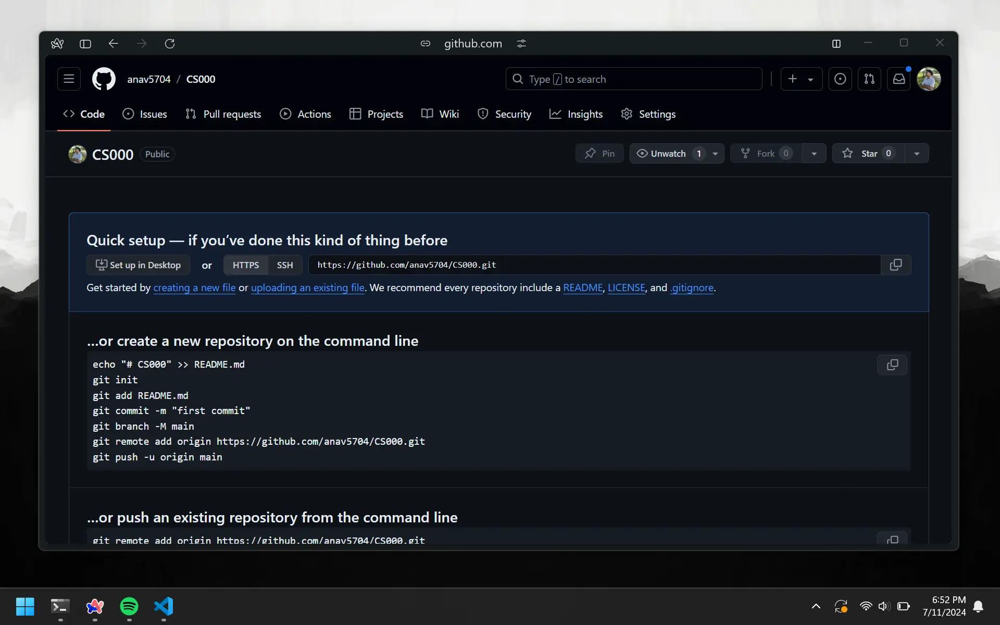
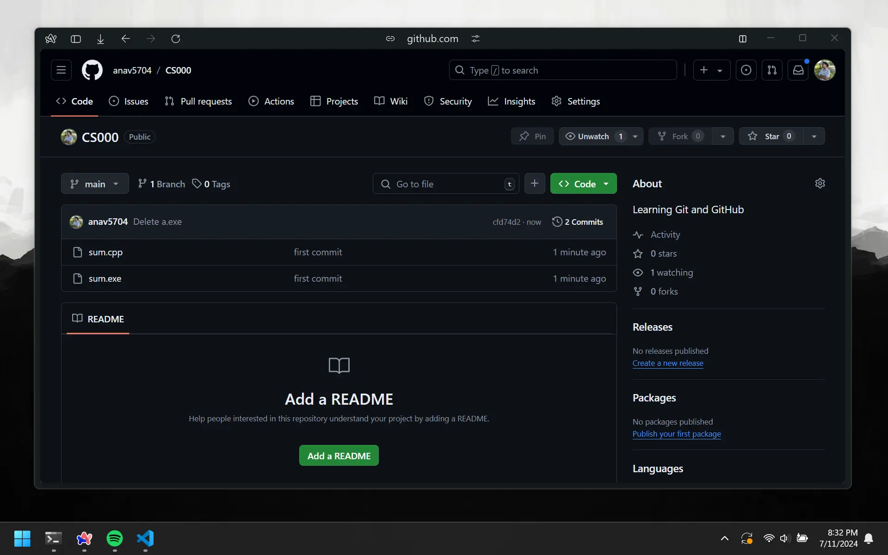

# Your First Repo

We are now doing to upload the project we made onto GitHub. Head back to repo tab on [GitHub](https://github.com) and create a new repository. You can do this by clicking the green `New` button in the top right corner of the page. Name it `CS000` and add a description.



# Repo Visibility

It would be a good idea to make your repository public. This will make it easier for you to share your code with your friends and lecturers. But there are times when you want to keep your code private. In relation to USP, this will be when you are working on assessed projects like assignments.

# Upload Project



After creation, you will be taken to the repository page. There are 3 sets of instructions given. We will be using the second set of instructions. Copy all of it and then navigate to your project directory in the terminal.

Our desired directory is located at `C:/Users/anav/code/CS000`. Since we set our starting directory to `C:/Users/anav/code` earlier, we just need to change into the `CS000` directory.

```bash
cd CS000
```

Now just copy and paste the instructions into the terminal. Do not copy the first line though. You will also need to change `git add README.md` to `git add .`

```bash
git init
git add .
git commit -m "first commit"
git branch -M main
git remote add origin https://github.com/anav5704/CS000.git
git push -u origin main
```

Whenever you start off a new project, you will need to do this. We will learn about each of these commands individually in the next chapter.

# Check Repository

Now if you go back to your repository on GitHub, you will be able to see your files there. Congrats on pushing code to your first ever repository!


