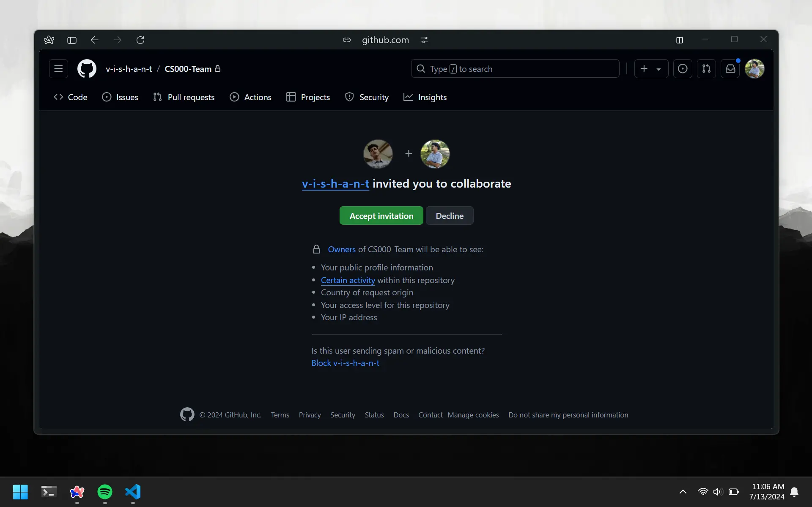
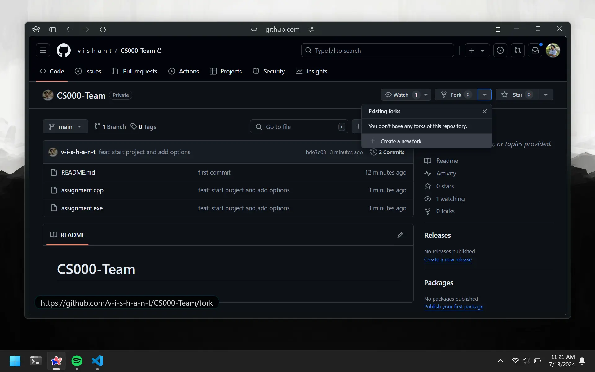
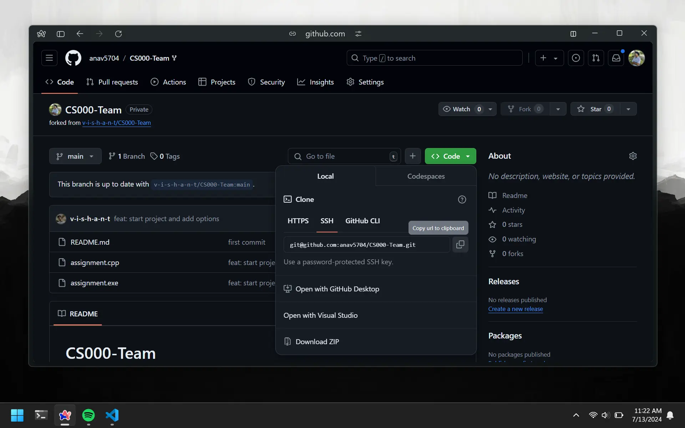

# Forking and Cloning

Remember how we first wrote code and then pushed it to GitHub? When you are working as a `collaborator`, the code will already be on GitHub. You will have to download it onto your computer first and then continue the cycle.

# Accept Invitation

Then the `owner` of the repo adds you as a collaborator, you will receive an invitation via email. Click the green `view invitation` button on the email. This will redirect you to your GitHub account. You wil be able to accept the invitation there.



# Forking The Repo

The previous repo was created by the person who was decided to be the `owner` of the repo. You do not have permission to make changes to the repo. What we can do is create a copy of the repo and make it our own. This is called `forking`.

To fork a repo, you will need to click on the `Fork` button on the top right of the repo. This will create a copy of the repo under your GitHub account. You will be able to make changes to the repo and push them to your copy.



You will have to go through the same process as when you create a new repo. If you followed along with the previous lesson, then you might already have a repo named `CS000`. Make sure the name for the forked repo is different.

# Cloning The Repo

Now that we have our own copy of the assignment repo, we download it onto our computer. This is called `cloning`.
Note that when you push code, it will get added to the repo you forked, not the original repo.

To clone the repo, you're first going to need the `HTTPS` link. You can get this by clicking the green `Code` dropdown on the repo page.



Then open your terminal and navigate to the directory you want to clone the repo into. Finally, run the following command:

```bash
git clone <link you just copied>
```

That would look something like this:

```bash
git clone https://github.com/your-username/CS000.git
```

If you run `ls`, you will be able to se the newly cloned repo. Alternatively, you can find the repo using the file explorer.
