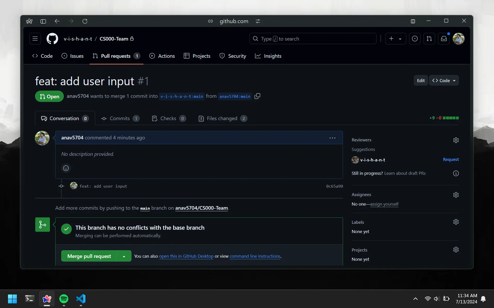

# Merging Overview

If you are the `owner` of the assignment repository, you can approve `contributors` code to be added to your repo. This is also one of the 2 places where you will encounter `merge conflicts` the most. To minimize the chances of merge conflicts, it would be a good idea to merge `prs` frequently.

# Merge Pull Request

To merge a `pr` you will need to first go to the `pull request` tab on your repo. You will see a list of all the `prs` that are open and need to be merged. Chose one and click the green `Merge pull request` button.

This will prompt you to fill in some details about the merge. Most of it will aleady be filled in for you, so leave those as is.
