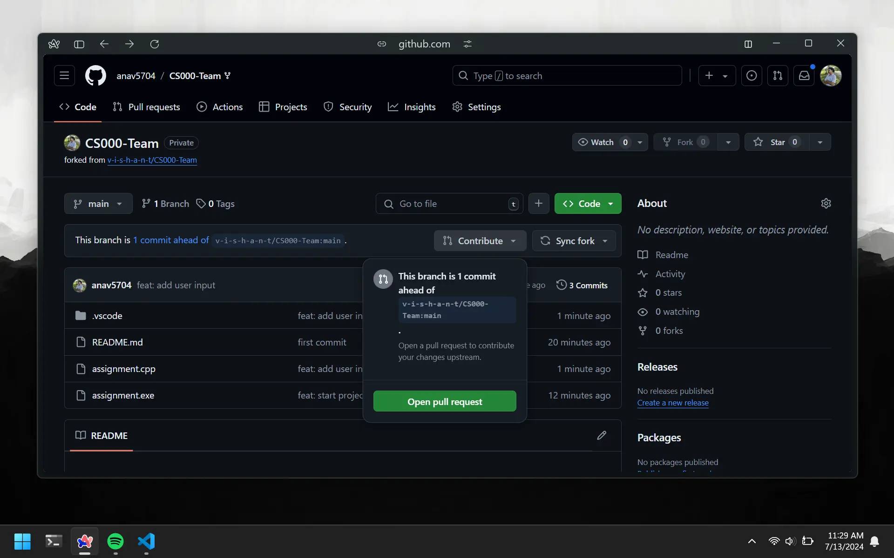

# Pull Request Overview

When we push code to GitHub, it gets added to our `forked` repository. In order to add it to the main assignment reorder, we need to create a `pull request`. A pull request is like asking the librarian to review and accept your new chapter into the official book. Saying or typing out `pull request` will get annoying quickly, so we just refer to them as `pr`.

# Create Pull Request

To create a pull request, you first have to go to the repo oo GitHub. Then click on the `Contribute` dropdown and select `Open Pull Request`. This will prompt you to fill in a few details like the title and description of the pull request. You can use your commit message as the title and leave the description blank.

# Subsequent Commits

Scenario: You make 5 commits to your forked repository. Then you create a pull request for it. The `owner` of the repository merges your pull request. Then you will have to make a new pull request if you have to make more commits.

Scenario: You make 5 commits to your forked repository. Then you create a pull request for it. The `owner` of the repository does not merge your pull request. If you want to make more commits, they will get added to the same pull request.
