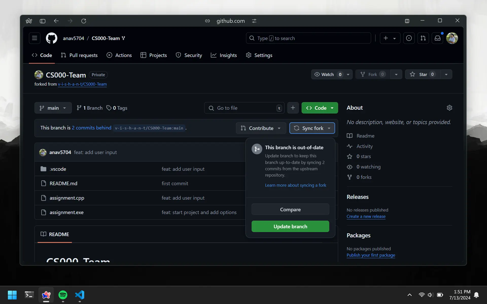

# Syncing and Pulling

When `pull requests` are merged, a new version of the code is created. This version will exist only with the person that created the `pull request` and the main assignment repo.

# The Problem

Let's recap what we have done so far:

`owner` created assignment repo.\
`owner` pushed some starter code.\
`contributor` forked and cloned repo.\
`contributor` added a small feature.\
`contributor` pushed and created a pr.\
`owner` merged the pr to the main repo.

What does this mean?

`contributor` repo on GitHub is up-to-date.\
`contributor` repo on their computer is up-to-date.\
`owners` repo on GitHub IS up-to-date.\
`owners` repo on their computer is **behind**.\
`other contributors` repos on GitHub are **behind**.\
`other contributors` repos on their computer are **behind**.

# The Solution

A repository exists in two places: on your computer and on GitHub. We need first update our forked repo with the latest version of the code from the main assignment repo. Then we need to download the latest version of the code from your forked repo on our computer.

`Syncing` - Updates repo on GitHub.\
`Pulling` - Updates repo on computer.

## Owner

This person will only have to update the repo on their computer. They have the main repo and this gets updated when the pull request is merged.

## Contributor

This is the contributor got their pull request merged. This person will not have to do anything.

## Other Contributors

These are the people who will have to update both their forked repo on GitHub and the repo on their computer.

# Syncing On GitHub

Go to your forked repo on GitHub. You will see a dropdown that says `Sync Fork`. Click on it and then click on the green button that says `Update Branch`.



This will update your forked repo with the latest version of the code from GitHub.

# Pulling From GitHub

Remember `Git Clone` command we used earlier? This is what we used to download the whole repo from GitHub at first. But this time we already have the repo on our computer. So all we noeed to do is to pull the latest version of the code from GitHub.

```bash
git pull
```

This command will pull (download) the updated version of the code from your forked repo on GitHub. If you open up the code, you will see that the `user input` feature your group member added is now there.
